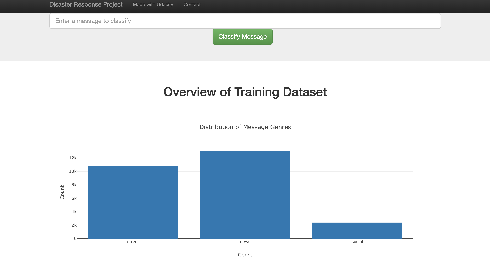
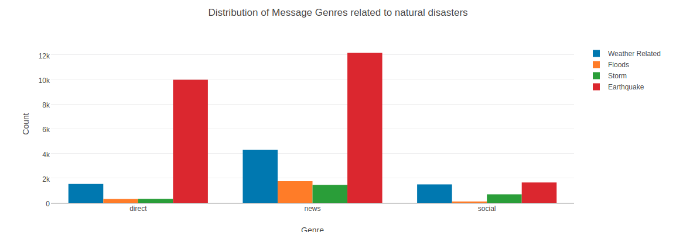
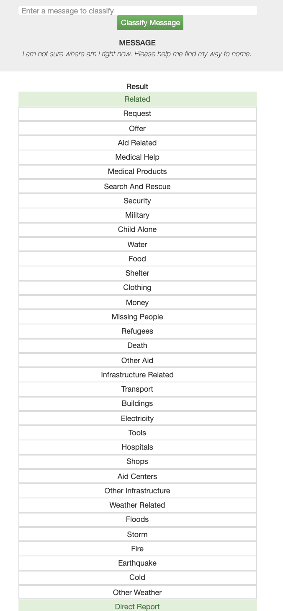

# Disaster Response Pipeline Project


### 1. Project Overview
In this project, I built a model for an API that classifies disaster messages.

I used a data set containing real messages that were sent during disaster events and created a machine learning pipeline to categorize these events in order yp send the messages to an appropriate disaster relief agency.

The final result can be found on a web app where an emergency worker can input a new message and get classification results in several categories. The web app will also display visualizations of the data. 

The distribution of training data is as follows,


You can also see the distribution of all natural disaster related data below. 


Below is a screenshot of the web app.



### 2. File Descriptions
```
─ README.md
─ pic.png
─ pic2.png
app/
├── run.py
templates/
├── go.html
├── master.html
data/
├── DisasterResponse.db
├── disaster_categories.csv
├── disaster_messages.csv
├── process_data.py
models/
├── classifier.pkl
├── train_classifier.py
```

### 3. Instructions:
1. Run the following commands in the project's root directory to set up your database and model.

    - To run ETL pipeline that cleans data and stores in database
        `python data/process_data.py data/disaster_messages.csv data/disaster_categories.csv data/DisasterResponse.db`
    - To run ML pipeline that trains classifier and saves
        `python models/train_classifier.py data/DisasterResponse.db models/classifier.pkl`

2. Run the following command in the app's directory to run your web app.
    `python run.py`

3. Go to http://0.0.0.0:3001/
